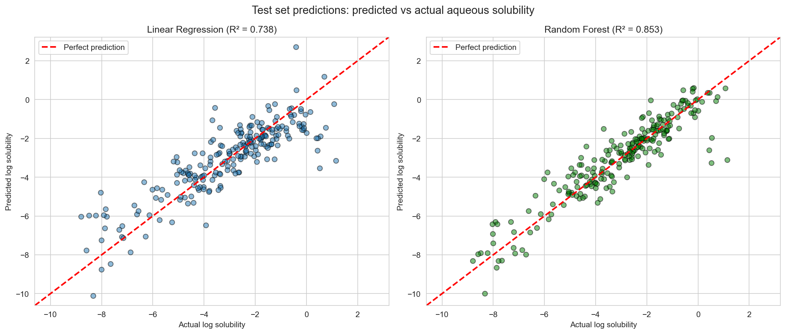
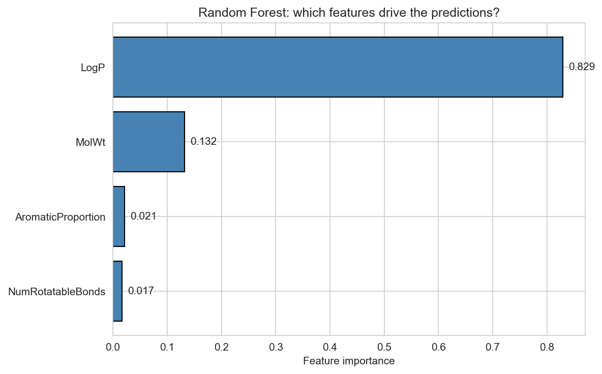

# Molecular Solubility Predictor

Predicting aqueous solubility of small molecules from chemical structure
using classical machine learning.

## Overview

Aqueous solubility — how well a compound dissolves in water — is a fundamental
property in drug discovery, environmental science, and chemical engineering.
Measuring it experimentally is slow and expensive; predicting it from molecular
structure is a long-standing problem in cheminformatics.

This project reproduces the classical approach from Delaney (2004) on the ESOL
dataset (1,128 small molecules) and compares it against a Random Forest model.

## Dataset

The ESOL (Estimated SOLubility) dataset contains 1,128 organic compounds with
experimentally measured aqueous solubility values (log mol/L).

Source: Delaney, J. S. (2004). ESOL: Estimating Aqueous Solubility Directly
from Molecular Structure. *Journal of Chemical Information and Computer
Sciences*, 44(3), 1000–1005.

## Features

Four molecular descriptors computed using RDKit:
- **Molecular weight (MolWt)** — proxy for molecular size
- **LogP** — octanol-water partition coefficient, measures hydrophobicity
- **Number of rotatable bonds** — proxy for molecular flexibility
- **Aromatic proportion** — fraction of heavy atoms in aromatic rings

## Models

- **Linear Regression** — baseline, reproducing Delaney's 2004 approach
- **Random Forest Regressor** — 100 trees, default hyperparameters

## Results

The dataset was split 80/20 into training (902 molecules) and test (226 molecules)
sets. All metrics below are reported on the held-out test set.

| Model              | Test RMSE | Test R² | Test MAE |
|--------------------|----------:|--------:|---------:|
| Linear Regression  |    1.113  |  0.738  |   0.833  |
| Random Forest      |    0.833  |  0.853  |   0.584  |

### Predicted vs Actual



Both models track the diagonal (perfect prediction line), but Random Forest
clusters more tightly, especially in the densely populated -6 to -2 region.

### Feature importance



LogP alone contributes 83% of Random Forest's predictive power, with MolWt
adding another 13%. This independently recovers the standard cheminformatics
intuition: hydrophobicity is the dominant determinant of aqueous solubility.

### Linear regression coefficients

The Linear Regression model is fully interpretable. The learned coefficients are:

| Feature             | Coefficient | Direction |
|---------------------|------------:|-----------|
| MolWt               |    -0.0062  | larger molecules less soluble |
| LogP                |    -0.7551  | more hydrophobic less soluble |
| NumRotatableBonds   |    -0.0088  | more flexible slightly less soluble |
| AromaticProportion  |    -0.3521  | more aromatic less soluble |
| intercept           |    +0.2223  | — |

All four signs are physically correct. The R² of 0.738 closely matches Delaney's
original reported value of 0.72 using these same descriptors.

## Discussion

**Random Forest outperforms Linear Regression** on test R² (0.853 vs 0.738),
suggesting non-linear interactions between features that the linear model
cannot capture. However, the Random Forest shows a clear train-test gap
(train R² = 0.981, test R² = 0.853) indicating some overfitting; in a
production setting, hyperparameter tuning (max_depth, min_samples_leaf) or
adding regularization would be appropriate next steps.

**Linear Regression is more interpretable.** Each coefficient has a clear
physical meaning, and the model's behavior is fully transparent. For
regulatory or scientific contexts where interpretability matters more than
raw accuracy, the linear model remains valuable.

**LogP dominates.** Both models agree that octanol-water partition is the
single most important feature. This matches the classical Lipinski "rule
of five" intuition and centuries of solubility chemistry.

## Limitations

- Only four features used; modern cheminformatics models use hundreds
  (Morgan fingerprints, graph neural networks, etc.)
- Dataset is small (1,128 molecules) and biased toward drug-like compounds
- No cross-validation; a single random split was used
- Random Forest hyperparameters not tuned

## Setup

```bash
# Clone the repo
git clone https://github.com/AISHDM/molecular-solubility-predictor.git
cd molecular-solubility-predictor

# Create environment (using conda)
conda create -n ml-chem python=3.12
conda activate ml-chem

# Install dependencies
conda install -c conda-forge numpy pandas scikit-learn matplotlib seaborn jupyter rdkit -y
```

## Usage

Open the exploration notebook in Jupyter or VS Code:

```bash
jupyter notebook notebooks/01_exploration.ipynb
```

Run all cells top to bottom.

## Project structure

```
.
├── data/                          # Raw dataset
│   └── delaney_solubility.csv
├── notebooks/
│   └── 01_exploration.ipynb       # End-to-end analysis
├── results/                       # Output plots and metrics
│   ├── predicted_vs_actual.png
│   ├── feature_importance.png
│   └── model_comparison.csv
├── requirements.txt
└── README.md
```

## Author

Dheeraj Meena — 2nd year B.Tech, Chemical Engineering, IIT Delhi
